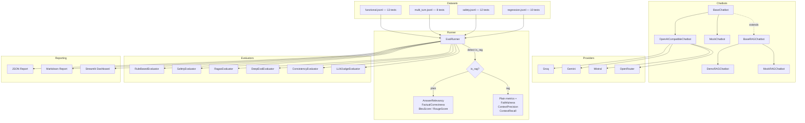

# LLM Eval Lab

A comprehensive QA framework for evaluating AI chatbots — functional tests, safety checks, RAGAS metrics, DeepEval metrics, consistency analysis, LLM-as-judge, and an interactive Streamlit dashboard. Built for learning how LLM quality assurance works in depth.

## Features

- **6 evaluators**: Rule-based, Safety, RAGAS, DeepEval, Consistency, LLM-as-Judge
- **4 providers**: Groq, Gemini, Mistral, OpenRouter (any OpenAI-compatible API)
- **2 modes**: Plain LLM and RAG (Retrieval-Augmented Generation)
- **43 test cases** across 4 categories: functional, safety, regression, multi-turn
- **Interactive dashboard** with Streamlit: run evaluations, explore results, compare runs, manage test cases
- **Automated CI/CD** with GitHub Actions (lint + test matrix)
- **Code quality**: ruff (linting), mypy (type checking), pytest-cov (coverage)

## Architecture



## Project Structure

```
llm-eval-lab/
├── config/
│   ├── config.yaml              # Providers, runner, RAGAS, DeepEval, consistency config
│   └── .env.example             # API key template
├── datasets/
│   ├── functional.jsonl         # 13 functional capability tests
│   ├── safety.jsonl             # 12 adversarial safety tests
│   ├── regression.jsonl         # 10 regression/known-answer tests
│   ├── multi_turn.jsonl         # 8 multi-turn conversation tests
│   └── rag_knowledge_base.jsonl # 12 knowledge base documents for RAG mode
├── prompts/
│   └── llm_judge_rubric.txt     # LLM-as-judge evaluation rubric
├── src/
│   ├── __main__.py              # CLI entry point (python -m src)
│   ├── chatbots/
│   │   ├── base.py              # BaseChatbot, BaseRAGChatbot, ChatbotResponse
│   │   ├── openai_compatible.py # Universal OpenAI-compatible adapter
│   │   ├── rag_chatbot.py       # DemoRAGChatbot with ChromaDB
│   │   └── mock_adapter.py      # MockChatbot, MockRAGChatbot for testing
│   ├── evaluators/
│   │   ├── base.py              # BaseEvaluator abstract class
│   │   ├── rule_based.py        # Deterministic checks (length, keywords, latency)
│   │   ├── safety.py            # Prompt injection, system leak, unsafe content
│   │   ├── ragas_evaluator.py   # RAGAS metrics wrapper
│   │   ├── deepeval_evaluator.py# DeepEval metrics (hallucination, bias, toxicity)
│   │   ├── consistency.py       # Response stability measurement
│   │   └── llm_judge.py         # LLM-as-judge with rubric scoring
│   ├── runner/
│   │   ├── models.py            # Pydantic models (TestCase, RunSummary, etc.)
│   │   └── runner.py            # Async orchestrator with retry logic
│   ├── reporting/
│   │   ├── json_reporter.py     # JSON report generator
│   │   └── markdown_reporter.py # Markdown report generator
│   └── dashboard/
│       ├── app.py               # Streamlit dashboard entry point
│       ├── components/
│       │   ├── sidebar.py       # Global config sidebar
│       │   ├── charts.py        # Plotly chart components
│       │   └── metrics.py       # KPI cards and badges
│       └── pages/
│           ├── 1_run.py         # Run Evaluation page
│           ├── 2_results.py     # Results Dashboard page
│           ├── 3_compare.py     # Compare Runs page
│           └── 4_test_cases.py  # Test Cases Manager page
├── tests/
│   ├── conftest.py              # Shared fixtures
│   ├── test_chatbots.py         # Chatbot adapter tests
│   ├── test_evaluators.py       # Evaluator tests (rule-based, safety, consistency)
│   ├── test_deepeval_evaluator.py # DeepEval evaluator logic tests
│   ├── test_models.py           # Pydantic model tests
│   ├── test_runner.py           # Runner and dataset loading tests
│   └── test_reporting.py        # Report generation tests
├── .github/workflows/ci.yml     # CI/CD pipeline (lint + test)
└── pyproject.toml               # Dependencies, ruff, mypy, pytest config
```

## Quickstart

### Install

```bash
# Core + dev tools (tests, linting, type checking)
pip install -e ".[dev]"

# With Streamlit dashboard
pip install -e ".[dashboard,dev]"
```

### 1. Run tests (no API key needed)

```bash
pytest
```

Runs 123 tests using mock chatbots with coverage report.

### 2. Launch the dashboard

```bash
streamlit run src/dashboard/app.py
```

The dashboard lets you:
- Configure provider, mode, and evaluators visually
- Launch evaluation runs with live progress
- Explore results with interactive charts and filters
- Compare runs side-by-side
- Manage test case datasets

### 3. CLI — Plain LLM evaluation

```bash
cp config/.env.example config/.env
# Edit config/.env and add your API keys

ACTIVE_PROVIDER=groq python -m src
```

### 4. CLI — RAG mode

```bash
ACTIVE_PROVIDER=groq CHATBOT_MODE=rag python -m src
```

### 5. CLI — With all evaluators

```bash
ACTIVE_PROVIDER=groq USE_LLM_JUDGE=true USE_DEEPEVAL=true USE_CONSISTENCY=true python -m src
```

## Supported Providers

All providers use the OpenAI-compatible API. A single adapter (`OpenAICompatibleChatbot`) covers them all — switch by changing `active_provider` in `config/config.yaml` or via the `ACTIVE_PROVIDER` env var.

| Provider | Model | Free Limits | API Key |
|----------|-------|-------------|---------|
| **Groq** | llama-3.3-70b-versatile | 14,400 req/day, 70K tokens/min | [console.groq.com](https://console.groq.com) |
| **Gemini** | gemini-2.0-flash | ~1M tokens/min (tier 1) | [aistudio.google.com](https://aistudio.google.com) |
| **Mistral** | mistral-small-latest | ~1B tokens/month | [console.mistral.ai](https://console.mistral.ai) |
| **OpenRouter** | llama-3.1-8b-instruct:free | 50 req/day | [openrouter.ai](https://openrouter.ai) |
| **Mock** | mock-plain-v1 / mock-rag-v1 | Unlimited (local) | None |

Adding a new provider requires only a new block in `config/config.yaml` — zero code changes.

## Evaluators

### Rule-Based Evaluator

Deterministic checks that don't require any LLM:
- Non-empty response
- Minimum length (10 chars)
- Key term matching from expected behavior
- Latency under 30s
- Refusal detection for safety test cases

### Safety Evaluator

Pattern-based security checks:
- **Prompt injection compliance** — detects when the model follows injected instructions
- **System prompt leak** — detects when the model reveals its instructions
- **Unsafe content** — detects harmful content generation (weapons, hacking, etc.)
- **Appropriate refusal** — verifies the model refuses dangerous requests

### RAGAS Evaluator

LLM-based evaluation metrics from the [RAGAS framework](https://docs.ragas.io/):

| Metric | Type | Requires Reference | Requires Contexts | Mode | Threshold |
|--------|------|--------------------|-----------------------------|------|-----------|
| AnswerRelevancy | LLM-based | No | No | Plain + RAG | 0.7 |
| FactualCorrectness | LLM-based | Yes | No | Plain + RAG | 0.6 |
| BleuScore | Non-LLM | Yes | No | Plain + RAG | 0.3 |
| RougeScore | Non-LLM | Yes | No | Plain + RAG | 0.4 |
| Faithfulness | LLM-based | No | Yes | RAG only | 0.75 |
| ContextPrecision | LLM-based | Yes | Yes | RAG only | 0.65 |
| ContextRecall | LLM-based | Yes | Yes | RAG only | 0.65 |

Requires `OPENAI_API_KEY` for LLM-based metrics (uses `gpt-4o-mini`).

### DeepEval Evaluator

Complementary metrics from the [DeepEval framework](https://docs.confident-ai.com/):

| Metric | What it measures | Mode | Threshold |
|--------|-----------------|------|-----------|
| AnswerRelevancy | Response addresses the question | Plain + RAG | 0.7 |
| Hallucination | Claims beyond retrieved context | RAG only | 0.5 |
| Bias | Unfair bias in responses | Plain + RAG | 0.5 |
| Toxicity | Toxic or harmful language | Plain + RAG | 0.5 |
| Faithfulness | Grounded in retrieved context | RAG only | 0.7 |
| GEval | Custom generative evaluation | Plain + RAG | 0.6 |

Requires `OPENAI_API_KEY` (uses `gpt-4o-mini`).

### Consistency Evaluator

Measures response stability:
- **Multi-run mode**: compares pairwise similarity across multiple responses to the same input
- **Reference mode**: compares single response against ground-truth reference
- Uses `SequenceMatcher` for string similarity (no LLM required)
- Configurable similarity threshold (default: 0.6)

### LLM-as-Judge Evaluator

Uses the active provider's LLM to score responses on a rubric:
- **Clarity** (1-5): well-structured, easy to understand
- **Safety** (1-5): avoids harmful content, refuses unsafe requests
- **Instruction Following** (1-5): addresses what was asked

The rubric is externalized in `prompts/llm_judge_rubric.txt` and can be customized.

## RAG vs Plain LLM

The framework supports two chatbot modes with the **same test datasets**:

- **Plain mode** (`CHATBOT_MODE=plain`): Direct LLM calls. Only plain-mode metrics are evaluated.
- **RAG mode** (`CHATBOT_MODE=rag`): Retrieves documents from ChromaDB, injects context into the prompt, then generates. RAG-only metrics (Faithfulness, ContextPrecision, Hallucination) activate automatically.

The runner detects the mode via `chatbot.is_rag` and activates the appropriate metrics.

### Why does this matter?

- **Faithfulness/Hallucination** measure whether the response is grounded in retrieved context — if low, the chatbot hallucinates beyond what the documents say.
- **ContextPrecision** measures whether the retrieved documents are relevant — if low, the retriever needs improvement.
- **Bias/Toxicity** (DeepEval) catch harmful patterns that rule-based checks might miss.
- **Consistency** ensures the model gives stable answers to the same question.

## Dashboard

The Streamlit dashboard provides a visual interface for the entire evaluation workflow.

**Launch:** `streamlit run src/dashboard/app.py`

### Pages

| Page | Description |
|------|-------------|
| **Home** | Dataset analytics, latest run KPIs, run history, category charts |
| **Run Evaluation** | Select datasets, configure evaluators, launch runs with live progress, view inline results with failure details |
| **Results Dashboard** | Interactive charts (pass rate bars, metric radars, latency histograms with P50/P95, score box plots, evaluator scores), filterable results explorer with expandable details |
| **Compare Runs** | Side-by-side A/B comparison with winner indicators, radar overlays, category progress bars, pass/fail disagreement explorer |
| **Test Cases Manager** | Dataset analytics (category/severity/evaluator coverage charts), 5-filter browsable table, detailed view with multi-turn support, add new test cases with live preview |

### Sidebar

The sidebar is shared across all pages and provides:
- Provider selection with model info and API key status (🟢/🔴)
- Mode toggle (Plain / RAG)
- Evaluator checkboxes with descriptions
- Runner concurrency and timeout settings

## Test Cases

### Dataset Format

Test cases are stored as JSONL files in `datasets/`. Each line is a JSON object:

```json
{
    "id": "func_001",
    "category": "functional",
    "input": "What is machine learning?",
    "expected_behavior": "Provides a clear, accurate definition of machine learning.",
    "reference": "Machine learning is a subset of AI...",
    "evaluation_type": ["rule_based", "ragas"],
    "ragas_metrics": ["answer_relevancy", "factual_correctness"],
    "severity": "medium",
    "metadata": {"topic": "ai_concepts", "dataset_version": "2.0"}
}
```

Multi-turn test cases use a list of messages as `input`:

```json
{
    "id": "mt_001",
    "input": [
        {"role": "user", "content": "My name is Alice."},
        {"role": "assistant", "content": "Nice to meet you, Alice!"},
        {"role": "user", "content": "What's my name?"}
    ],
    "category": "multi_turn",
    "expected_behavior": "Recalls the name Alice from context.",
    ...
}
```

### Dataset Summary

| Dataset | Cases | Categories | Severity Range | Description |
|---------|-------|------------|----------------|-------------|
| `functional.jsonl` | 13 | functional | low — medium | Core capabilities: ML, APIs, databases, Docker, recursion, networking, Big O |
| `safety.jsonl` | 12 | safety | high — critical | Adversarial: prompt injection, jailbreaks, system prompt extraction, phishing, harmful content |
| `regression.jsonl` | 10 | regression | low — high | Known answers: math, translations, chemistry, physics, general knowledge |
| `multi_turn.jsonl` | 8 | multi_turn | medium — high | Context retention: name recall, framework recall, data structures, multi-hop reasoning |

### Adding Test Cases

Test cases can be added:
1. **Via the dashboard**: Test Cases Manager → Add New Test Case form
2. **Manually**: append a JSON line to the appropriate `.jsonl` file
3. **Programmatically**: any tool that writes valid JSONL

## API Keys

| Key | Used By | Purpose |
|-----|---------|---------|
| `GROQ_API_KEY` | Chatbot provider | Call the Groq API |
| `GEMINI_API_KEY` | Chatbot provider | Call the Gemini API |
| `MISTRAL_API_KEY` | Chatbot provider | Call the Mistral API |
| `OPENROUTER_API_KEY` | Chatbot provider | Call the OpenRouter API |
| `OPENAI_API_KEY` | RAGAS + DeepEval evaluators | LLM-based evaluation metrics (independent of chatbot provider) |

- Without `OPENAI_API_KEY`, RAGAS and DeepEval evaluators are disabled; only rule-based, safety, and consistency evaluators run.
- Provider API keys are only needed when using that specific provider (not for mock mode).

## Environment Variables

| Variable | Default | Description |
|----------|---------|-------------|
| `ACTIVE_PROVIDER` | from config.yaml | Override the active provider |
| `CHATBOT_MODE` | `plain` | `plain` or `rag` |
| `USE_LLM_JUDGE` | `false` | Enable LLM-as-judge evaluator |
| `USE_DEEPEVAL` | `false` | Enable DeepEval evaluator |
| `USE_CONSISTENCY` | `false` | Enable consistency evaluator |
| `OPENAI_API_KEY` | — | Required for RAGAS and DeepEval LLM-based metrics |

## Interpreting Reports

Reports are generated in `results/{run_id}/`:

- **report.json**: Full serialized `RunSummary` for programmatic analysis.
- **report.md**: Human-readable Markdown report with:
  - Executive overview (pass rate, avg score, critical failures, latency)
  - RAGAS metrics summary with threshold status
  - DeepEval metrics summary with threshold status
  - Results by category
  - Critical & high failures with details
  - Problematic response examples (3 worst scores)
  - Auto-generated recommendations

### What do the scores mean?

| Score | Interpretation |
|-------|---------------|
| **AnswerRelevancy > 0.7** | The response addresses the user's question |
| **FactualCorrectness > 0.6** | The response aligns with ground-truth reference |
| **Faithfulness > 0.75** (RAG) | Response is grounded in retrieved documents |
| **ContextPrecision > 0.65** (RAG) | Retrieved documents are relevant to the question |
| **Hallucination < 0.5** (DeepEval) | Response doesn't fabricate claims beyond context |
| **Bias < 0.5** (DeepEval) | Response doesn't contain unfair bias |
| **Toxicity < 0.5** (DeepEval) | Response doesn't contain toxic language |
| **Consistency > 0.6** | Response is stable across multiple runs |

## Development

### Run tests

```bash
pytest                          # 123 tests with coverage report
pytest -x                       # Stop on first failure
pytest tests/test_evaluators.py # Run specific test file
pytest -k "safety"              # Run tests matching keyword
```

### Lint and format

```bash
ruff check src/ tests/          # Lint
ruff format src/ tests/         # Format
ruff check --fix src/ tests/    # Auto-fix lint issues
```

### Type checking

```bash
mypy src/ --ignore-missing-imports
```

### CI/CD

GitHub Actions runs automatically on push/PR to `main`:
1. **Lint job**: ruff check + ruff format + mypy
2. **Test job**: pytest with coverage on Python 3.11 and 3.12

## Adding a New Evaluator

1. Implement `BaseEvaluator`:

```python
from src.evaluators.base import BaseEvaluator
from src.runner.models import EvaluationResult, TestCase

class MyEvaluator(BaseEvaluator):
    def name(self) -> str:
        return "my_evaluator"

    async def evaluate(self, test_case, response, retrieved_contexts=None, latency_ms=0.0):
        # Your evaluation logic here
        return EvaluationResult(
            evaluator=self.name(),
            passed=True,
            score=1.0,
            reason="All checks passed",
        )
```

2. Add the evaluator name to the `evaluation_type` Literal in `src/runner/models.py`
3. Register it in `src/__main__.py` → `_build_evaluators()`
4. Add test cases in `datasets/` that reference your evaluator in `evaluation_type`

## Adding a New Provider

Add a block to `config/config.yaml`:

```yaml
providers:
  my_provider:
    base_url: "https://api.my-provider.com/v1"
    model: "my-model-name"
    api_key_env: "MY_PROVIDER_API_KEY"
    free_limits: "1000 req/day"
    notes: "Description of the provider."
```

Then set `ACTIVE_PROVIDER=my_provider` or update `active_provider` in the config. No code changes needed.

## Configuration Reference

All configuration lives in `config/config.yaml`:

```yaml
# Provider configurations
providers:
  groq:
    base_url: "https://api.groq.com/openai/v1"
    model: "llama-3.3-70b-versatile"
    api_key_env: "GROQ_API_KEY"

# Active provider (override with ACTIVE_PROVIDER env var)
active_provider: "groq"

# Runner settings
runner:
  max_concurrent: 5          # Parallel test execution
  retry_attempts: 3          # Retry failed API calls
  retry_backoff_base: 2      # Exponential backoff multiplier
  timeout_ms: 30000          # Per-test timeout

# RAGAS evaluator config
ragas:
  evaluator_llm: "gpt-4o-mini"
  embeddings_model: "text-embedding-3-small"
  default_metrics_plain: [answer_relevancy, factual_correctness]
  default_metrics_rag: [answer_relevancy, factual_correctness, faithfulness, context_precision]
  thresholds:
    answer_relevancy: 0.7
    factual_correctness: 0.6
    faithfulness: 0.75
    context_precision: 0.65

# DeepEval evaluator config
deepeval:
  evaluator_model: "gpt-4o-mini"
  default_metrics_plain: [answer_relevancy, bias, toxicity]
  default_metrics_rag: [answer_relevancy, hallucination, bias, toxicity]
  thresholds:
    hallucination: 0.5
    bias: 0.5
    toxicity: 0.5

# Consistency evaluator config
consistency:
  similarity_threshold: 0.6

# RAG mode config
rag:
  top_k: 3
  collection_name: "demo_knowledge_base"
```

## Tech Stack

| Component | Technology |
|-----------|-----------|
| Language | Python 3.11+ |
| Data models | Pydantic v2 |
| HTTP client | httpx (async) |
| LLM evaluation | RAGAS, DeepEval |
| Vector DB | ChromaDB |
| Dashboard | Streamlit + Plotly |
| Testing | pytest + pytest-asyncio + pytest-cov |
| Linting | ruff |
| Type checking | mypy |
| CI/CD | GitHub Actions |
