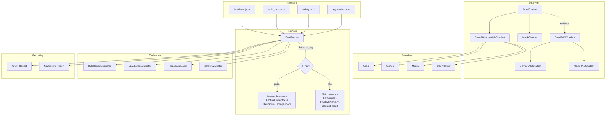

# LLM Eval Lab

A QA framework for evaluating AI chatbots — functional tests, safety checks, RAGAS metrics, and LLM-as-judge. Built for learning how LLM QA works in depth.

## Architecture



## Supported Providers

All providers use the OpenAI-compatible API. A single adapter (`OpenAICompatibleChatbot`) covers them all — switch by changing `active_provider` in `config/config.yaml`.

| Provider | Model | Free Limits | API Key |
|----------|-------|-------------|---------|
| **Groq** | llama-3.3-70b-versatile | 14,400 req/day, 70K tokens/min | [console.groq.com](https://console.groq.com) |
| **Gemini** | gemini-2.0-flash | ~1M tokens/min (tier 1) | [aistudio.google.com](https://aistudio.google.com) |
| **Mistral** | mistral-small-latest | ~1B tokens/month | [console.mistral.ai](https://console.mistral.ai) |
| **OpenRouter** | llama-3.1-8b-instruct:free | 50 req/day | [openrouter.ai](https://openrouter.ai) |

Adding a new provider requires only a new block in `config/config.yaml` — zero code changes.

## RAG vs Plain LLM

The framework supports two chatbot modes:

| Metric | Type | Requires reference | Requires retrieved_contexts | Mode |
|--------|------|--------------------|-----------------------------|------|
| AnswerRelevancy | LLM-based | No | No | Plain + RAG |
| FactualCorrectness | LLM-based | Yes | No | Plain + RAG |
| BleuScore | Non-LLM | Yes | No | Plain + RAG |
| RougeScore | Non-LLM | Yes | No | Plain + RAG |
| Faithfulness | LLM-based | No | Yes | RAG only |
| ContextPrecision | LLM-based | Yes | Yes | RAG only |
| ContextRecall | LLM-based | Yes | Yes | RAG only |

- **Plain mode**: The model responds directly without external context. Only plain metrics are evaluated.
- **RAG mode**: The model receives retrieved documents from ChromaDB before responding. RAG-only metrics (Faithfulness, ContextPrecision) are automatically activated.
- The **same test datasets** work for both modes — the runner detects the mode via `chatbot.is_rag` and activates the appropriate metrics.

### Why does this matter?

- **Faithfulness** measures whether the response is grounded in the retrieved context — if low, the chatbot is hallucinating beyond what the documents say.
- **ContextPrecision** measures whether the retrieved documents are relevant to the question — if low, the retriever needs improvement.
- **AnswerRelevancy** and **FactualCorrectness** work in both modes and measure response quality regardless of retrieval.

## Quickstart

### Install dependencies

```bash
pip install -e ".[dev]"
```

### 1. Mock mode (no API key needed)

```bash
python -m pytest tests/
```

### 2. Plain LLM with Groq

```bash
cp config/.env.example config/.env
# Edit config/.env and add your GROQ_API_KEY and OPENAI_API_KEY (for RAGAS)
ACTIVE_PROVIDER=groq python -m src
```

### 3. RAG chatbot with Groq + ChromaDB

```bash
ACTIVE_PROVIDER=groq CHATBOT_MODE=rag python -m src
```

### 4. With LLM-as-judge

```bash
ACTIVE_PROVIDER=groq USE_LLM_JUDGE=true python -m src
```

## Important: API Keys

- **Chatbot provider keys** (`GROQ_API_KEY`, `GEMINI_API_KEY`, etc.): Used to call the chatbot under test.
- **OPENAI_API_KEY**: Used by the **RAGAS evaluator** for LLM-based metrics (AnswerRelevancy, FactualCorrectness, Faithfulness, ContextPrecision). This is independent of the chatbot provider. Non-LLM metrics (BleuScore, RougeScore) don't need it.
- Without `OPENAI_API_KEY`, the RAGAS evaluator is disabled and only rule-based + safety evaluators run.

## Interpreting Reports

Reports are generated in `results/{run_id}/`:

- **report.json**: Full serialized `RunSummary` for programmatic analysis.
- **report.md**: Human-readable report with:
  - Executive overview (pass rate, avg score, critical failures)
  - RAGAS metrics summary with threshold status
  - Results by category
  - Critical & high failures with details
  - Auto-generated recommendations

### What do RAGAS scores mean?

- **AnswerRelevancy > 0.7**: The response addresses the user's question.
- **FactualCorrectness > 0.6**: The response aligns with the ground-truth reference.
- **Faithfulness > 0.75** (RAG only): The response only contains claims supported by retrieved documents.
- **ContextPrecision > 0.65** (RAG only): The retrieved documents are relevant to the question.

## Adding a New Evaluator

Implement `BaseEvaluator`:

```python
from src.evaluators.base import BaseEvaluator
from src.runner.models import EvaluationResult, TestCase

class MyEvaluator(BaseEvaluator):
    def name(self) -> str:
        return "my_evaluator"

    async def evaluate(self, test_case, response, retrieved_contexts=None, latency_ms=0.0):
        # Your evaluation logic
        return EvaluationResult(evaluator=self.name(), passed=True, score=1.0, reason="OK")
```

Then register it in the runner's evaluators dict.

## Roadmap

- CI/CD integration (GitHub Actions)
- Cross-provider comparison reports
- More RAGAS metrics (ContextEntityRecall, NoiseSensitivity)
- Ollama support for fully local evaluation
- HTML reporter with interactive charts
- Dataset versioning and diff tracking
